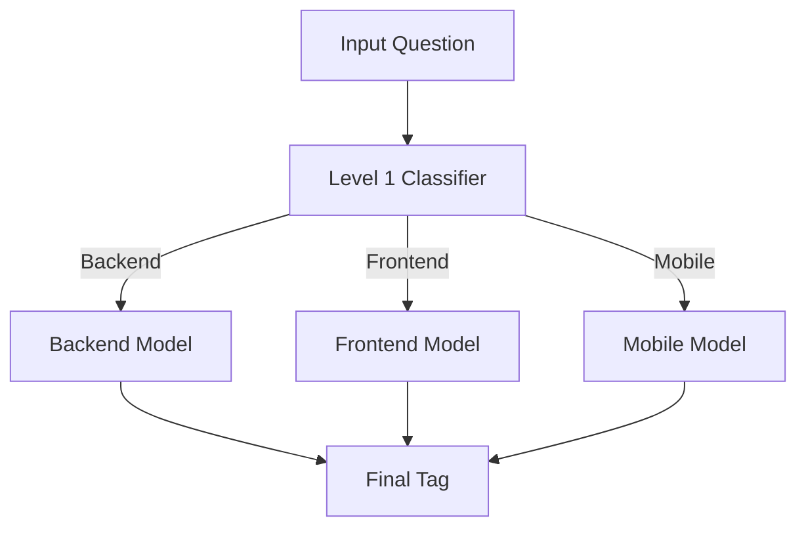

---

#  Stack Overflow Tag Classifier (Hierarchical SVM)

##  Overview

This project builds a **machine learning system** to automatically predict programming language tags from Stack Overflow questions.

The solution uses **traditional NLP + hierarchical Support Vector Machines (SVM)** — no neural networks — and achieves **~88% overall accuracy**.

---

##  Problem Statement

Given a dataset of Stack Overflow questions:

* Input → Question text
* Output → Programming language tag

The model is trained on **75% of the data** and evaluated on the remaining **25%**.

---

##  Key Idea

Instead of using a single flat classifier, this project uses a **hierarchical approach**:

1. **Level 1 → Domain Classification**

   * Backend
   * Frontend
   * Mobile

2. **Level 2 → Specialized Classifiers**

   * Each domain has its own optimized model

This improves accuracy by reducing class confusion.

---

#  System Architecture



---

##  Final Tag Structure

```
BACKEND:
c, c++, dotnet_family, java, mysql, php, python, ruby-on-rails, sql

FRONTEND:
angularjs, css, html, javascript, jquery

MOBILE:
android, apple (ios + iphone + objective-c)
```

---

##  Features & Engineering

###  Text Processing

* Lowercasing
* HTML/code removal
* Token normalization (e.g., `c# → csharp`)
* Noise reduction

### 🔹 Feature Extraction

* TF-IDF vectorization
* n-grams (1–3)
* Domain-specific tokens

###  Label Engineering (Critical)

* `c#`, `.net`, `asp.net` → **dotnet_family**
* `ios`, `iphone`, `objective-c` → **apple**

---

##  Models Used

| Level   | Model      | Description            |
| ------- | ---------- | ---------------------- |
| Level 1 | Linear SVM | Domain classifier      |
| Level 2 | Linear SVM | Specialized per domain |

---

##  Results

###  Level 1 (Domain Classification)

* Accuracy: **96.4%**

###  Level 2 Models

| Domain   | Accuracy |
| -------- | -------- |
| Backend  | 90.7%    |
| Frontend | 88.3%    |
| Mobile   | 97.4%    |

---

##  Final Performance

 **Overall Hierarchical Accuracy ≈ 88%**

| Approach               | Accuracy |
| ---------------------- | -------- |
| Baseline TF-IDF        | ~78%     |
| Improved preprocessing | ~80%     |
| Label merging          | ~86%     |
| **Hierarchical SVM**   | **~88%** |

---

##  Challenges

### 1. Label Overlap

* C#, .NET, ASP.NET share vocabulary

### 2. Domain Ambiguity

* HTML / CSS / JavaScript often co-occur

### 3. Platform Similarity

* iOS / iPhone / Objective-C

---

##  Solutions

* Label merging
* Hierarchical classification
* Domain-specific models
* Feature normalization

---

##  Project Structure

```
.
├── stack-overflow-data.csv
├── training_pipeline_final_svm_best.py
├── notebooks/
│   └── stack_overflow_analysis.ipynb
├── reports/
│   └── final_report.pdf
├── plots/
│   ├── confusion_matrix.png
│   └── accuracy_comparison.png
└── README.md
```

---

##  How to Run

### 1. Install dependencies

```bash
pip install pandas scikit-learn matplotlib seaborn
```

---

### 2. Run training pipeline

```bash
python -m training_pipeline_final_svm_best
```

---

### 3. Run notebook (optional)

```bash
jupyter notebook
```

---

##  Example Predictions

```
Input: "how to use entity framework in mvc c#"
Output: dotnet_family

Input: "css flexbox center div issue"
Output: css

Input: "android intent not working in activity"
Output: android

Input: "swift ios view controller crash"
Output: apple

Input: "python pandas groupby dataframe"
Output: python
```

---

##  Evaluation Metrics

* Accuracy
* Precision / Recall / F1-score
* Confusion Matrix

---

##  Key Takeaways

* Hierarchical classification improves performance significantly
* Label engineering is critical in NLP tasks
* Traditional ML (SVM + TF-IDF) remains highly effective

---

##  Future Improvements

* Add character-level features (TF-IDF char n-grams)
* Ensemble models
* Cross-validation tuning
* Multi-label classification

---

##  License

This project is for academic use.

---

##  Acknowledgements

* Stack Overflow dataset
* Scikit-learn library

---
